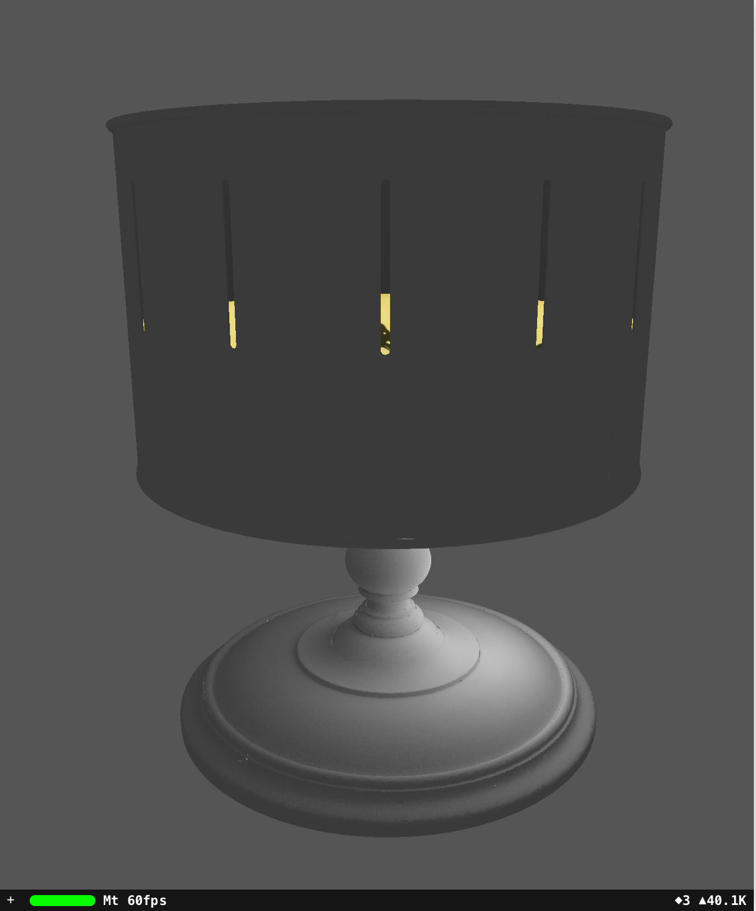

# ARKit-Zoetrope (under construction)

Explore a zoetrope with ARKit.

The Canada Science and Technology Museums Corporation has released a 3D scan of a zoetrope in their collection.

https://ingeniumcanada.org/ingenium/doc/education-programs/cstmc/zoetrope-artifact.stl

Blender is used to decimate the 17MB file zoetrope-artifact.stl to a smaller 4MB zoetrope.obj for a mobile device. A texture map is Cycles baked with a point light source to give zoetrope.jpg.

Difficult to observe the elephant animation when rotating the zoetrope because not only the slits are on and off rapidly but the iPad is also redrawing the screen at 60 frames per second. 

Experiment with keeping zoetrope.obj stationary and rotating the elephant.jpg mapped to a cylinder.

# Hardware

Tested on Apple 2018 9.7" iPad (A9 CPU or higher for ARKit) but should work on any iPad supporting ARKit.
The reason is that stereoscope (dependent on screen dimensions) is off.

# Software

Apple Swift Playgrounds 3.0 from iOS App Store. Swift Playgrounds lets kids 4+ program their iPad directly to experiment with ARKit and Scenekit.

https://www.apple.com/ca/swift/playgrounds/

ARKit and SceneKit (set up scene, read 3D files, attact a virtual camera for lefteye to ARKit iPad camera righteye to make a stereoscope, 6DOF tracking)

Blender 2.80 (optional) (https://www.blender.org/)

GIMP 2.10.8 (optional) (https://www.gimp.org/)

Note - Blender and GIMP are not available on iOS. They are used on other platforms to create content for Playgrounds.

# Tutorial

Start with a Blank template in Swift Playgrounds.

Copy and paste learn.swift.

Add files in Swift Playgrounds by tap "+", tap paper icon, and "Insert From...".

Add zoetrope.obj, zoetrope.jpg, cylinder.obj, and elephant.jpg.

Tap "Run My Code".

Tips:

This playground doesn't look for a flat plane to put virtual objects on, instead the initial position of the iPad is the world origin when "Run My Code" is pressed.

All virtual objects are positioned and oriented according to this world origin (with righteye.debugOptions on, the world origin is an XYZ or RGB axis).

If frame rate <60Hz, hold iPad still, swipe up from bottom edge of screen for HOME screen (or press HOME button), return to Swift Playgrounds.

# Credits

zoetrope.obj, zoetrope.jpg (derived from https://ingeniumcanada.org/ingenium/doc/education-programs/cstmc/zoetrope-artifact.stl)
Copyright: Canada Science and Technology Museums Corporation
https://ingeniumcanada.org/ingenium/doc/content/cstmc/CSTMC%20terms%20of%20use%203D%20ENG.pdf

elephant.jpg (derived from https://techno-science.ca/doc/education-programs/Zoetrope%20strips.pdf)
Copyright: Canada Science and Technology Museums Corporation
https://ingeniumcanada.org/ingenium/doc/content/cstmc/CSTMC%20terms%20of%20use%203D%20ENG.pdf

# References

https://ingeniumcanada.org/ingenium/museums/education/3D-zoetrope.php

https://ingeniumcanada.org/channel/articles/educational-resources-put-3d-artifacts-hands-canadian-students
