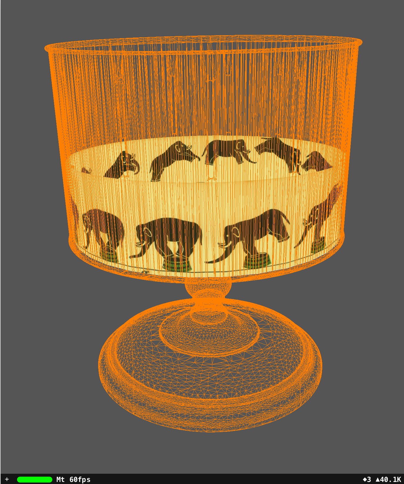

# ARKit-Zoetrope (under construction)

Explore a zoetrope with ARKit.

The Canada Science and Technology Museums Corporation has released a 3D scan of a zoetrope in their collection.

https://ingeniumcanada.org/ingenium/doc/education-programs/cstmc/zoetrope-artifact.stl

May be hard to observe the elephant animation when rotating the zoetrope because not only the slits are on and off rapidly but the iPad is also redrawing the screen at 60 frames per second.

Experiment with wireframe zoetrope.obj stationary and rotating elephant.jpg texture mapped to a cylinder. On a 2018 9.7" iPad, the elephant is jumping over a stationary platform.

# Hardware

Tested on Apple 2018 9.7" iPad (A9 CPU or higher for ARKit) but should work on any iPad supporting ARKit (stereoscope, dependent on screen dimensions, is off).

# Software

Apple Swift Playgrounds 3.0 from iOS App Store. Swift Playgrounds lets kids 4+ program their iPad directly to experiment with ARKit and Scenekit.

https://www.apple.com/ca/swift/playgrounds/

Blender 2.80 (optional) (https://www.blender.org/)

GIMP 2.10.8 or later (optional) (https://www.gimp.org/)

Note - Blender and GIMP are not available on iOS. They are used on other platforms to create content for Playgrounds.

Blender is used to decimate the 17MB file zoetrope-artifact.stl to a smaller 4MB zoetrope.obj for a mobile device. A texture map is Cycles baked with a point light source to give zoetrope.jpg.

GIMP is used to make strips from 

https://techno-science.ca/doc/education-programs/Zoetrope%20strips.pdf

# Tutorial

Start with a Blank template in Swift Playgrounds.

Copy and paste learn.swift.

Add the following files to Swift Playgrounds by tap "+", tap paper icon, and "Insert From...":

zoetrope.obj, zoetrope.jpg, cylinder.obj, and elephant.jpg

Tap "Run My Code".

The default learn.swift is the second image above.

To replicate the first image, uncomment:

node.geometry?.firstMaterial?.emission.contents = UIImage(named: "zoetrope.jpg") 
node.geometry?.firstMaterial?.isDoubleSided = false 

comment out:

node.geometry?.firstMaterial?.fillMode = .lines 
node.geometry?.firstMaterial?.emission.contents = UIColor.orange 
node.geometry?.firstMaterial?.isDoubleSided = true 

change duration to 1 in:

let rotate = SCNAction.repeatForever(SCNAction.rotate(by: .pi, around: SCNVector3(0,1,0), duration: 0.1083)) 

and uncomment:

node.runAction(rotate) 

Tips:

"Run My Code" with "Enable Results" to turn off Swift Playgrounds logging every objects created during runtime (little boxes that appears on the right side when "Run My Code", useful for inspection and debugging but consume memory).

This playground doesn't look for a flat plane to put virtual objects on, instead the initial position of the iPad is the world origin when "Run My Code" is pressed.

All virtual objects are positioned and oriented according to this world origin (with righteye.debugOptions on, the world origin is an XYZ or RGB axis).

If frame rate <60Hz, hold iPad still, swipe up from bottom edge of screen for HOME screen (or press HOME button), return to Swift Playgrounds.

# Credits

zoetrope.obj, zoetrope.jpg (derived from https://ingeniumcanada.org/ingenium/doc/education-programs/cstmc/zoetrope-artifact.stl) 
Copyright: Canada Science and Technology Museums Corporation 

elephant.jpg (derived from https://techno-science.ca/doc/education-programs/Zoetrope%20strips.pdf) 
Copyright: Canada Science and Technology Museums Corporation 

https://ingeniumcanada.org/ingenium/doc/content/cstmc/CSTMC%20terms%20of%20use%203D%20ENG.pdf

# References

https://ingeniumcanada.org/ingenium/museums/education/3D-zoetrope.php

https://ingeniumcanada.org/channel/articles/educational-resources-put-3d-artifacts-hands-canadian-students

https://en.wikipedia.org/wiki/Zoetrope

3D Zoetropes!

https://www.youtube.com/watch?v=40__creuq7c

https://www.youtube.com/watch?v=3-rPn0a56WE

https://www.youtube.com/watch?v=mAflS_s_aqo

